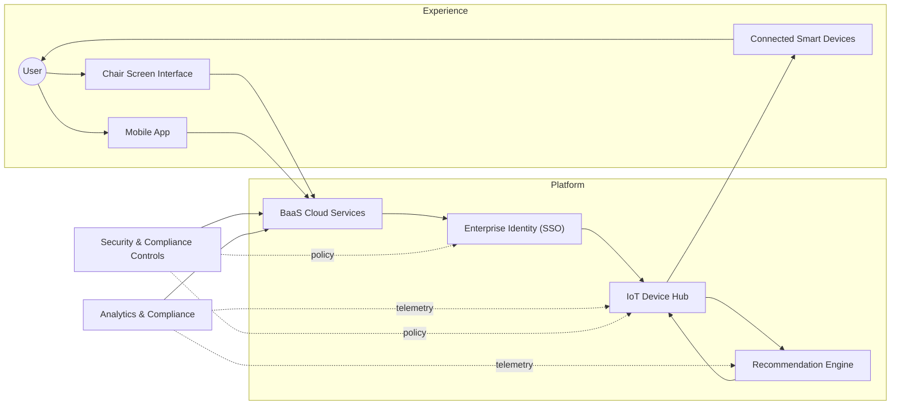

# Smart Experience Architecture

Render this diagram in VS Code by opening the command palette and choosing `Markdown: Open Preview`.

```mermaid
flowchart LR
    %% Experience layer
    subgraph Experience
        User((User))
        Chair["Chair Screen Interface"]
        Mobile["Mobile App"]
        SmartDevices["Connected Smart Devices"]
        User --> Chair
        User --> Mobile
        SmartDevices --> User
    end

    %% Platform layer
    subgraph Platform
        BaaS["BaaS Cloud Services"]
        SSO["Enterprise Identity (SSO)"]
        IoTHub["IoT Device Hub"]
        Reco["Recommendation Engine"]
    end

    %% Governance overlays
    Analytics["Analytics & Compliance"]
    Security["Security & Compliance Controls"]

    Chair --> BaaS
    Mobile --> BaaS
    Security --> BaaS
    Analytics --> BaaS

    BaaS --> SSO
    SSO --> IoTHub
    IoTHub --> Reco
    Reco --> IoTHub
    IoTHub --> SmartDevices

    Analytics -. telemetry .-> Reco
    Analytics -. telemetry .-> IoTHub
    Security -. policy .-> SSO
    Security -. policy .-> IoTHub
```
